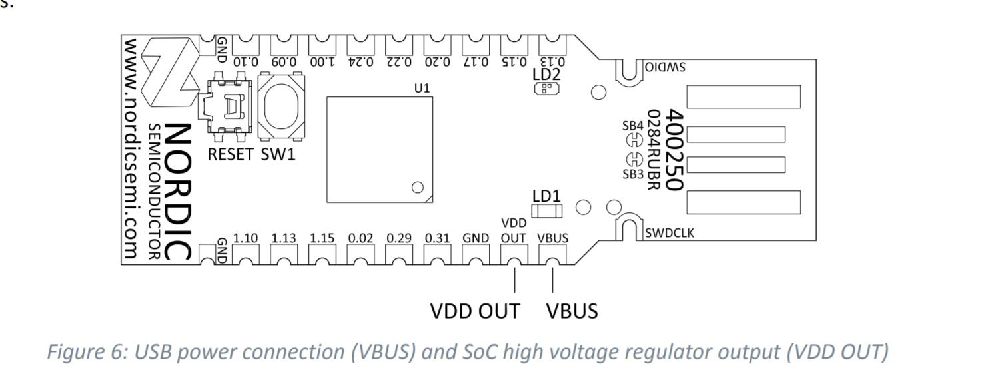
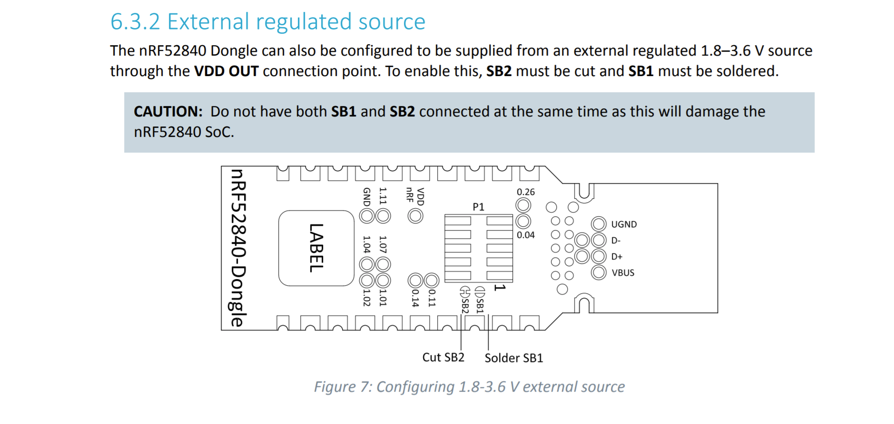
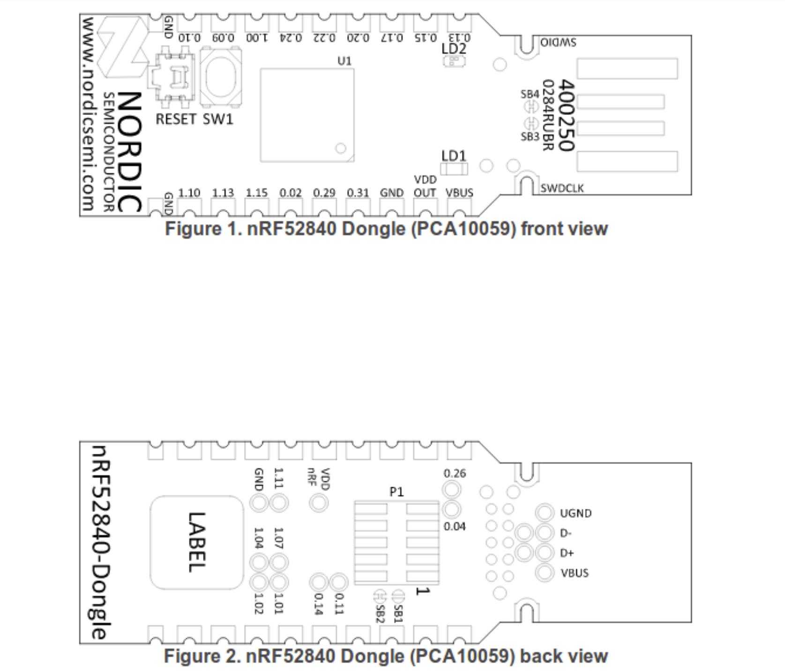

# Getting Started
**Components you will need:**
* [nRF52840 Nordic USB Dongle](https://www.digikey.com/en/products/detail/nordic-semiconductor-asa/NRF52840-DONGLE/9491124): (costs $10) this is this wireless board
*  [STLINK V2](https://www.ebay.com/c/896036216): (costs $3)
*   [CRC2032 button cell](https://en.wikipedia.org/wiki/Button_cell): (costs $2)
* [VLCD5 handle bar remote keypad](https://www.aliexpress.com/wholesale?catId=0&initiative_id=SB_20200828081711&origin=y&SearchText=LCD+controller+of+VLCD5+display+for+TSDZ2+electric): (costs $12) can be any keypad that works in the similar way
*  [STLINK V2](https://www.ebay.com/c/896036216): (costs $4)

  
  ## Pinout

## Schematic
(need to have a new diagram)

__Instructions:__ 

1. Install the bootloader on the Nordic nrf52840 dongle. To do this, follow the "Installing the Bootloader on the Nordic USB Dongle" link in the bootloader repository located [here](https://github.com/OpenSourceEBike/TSDZ2_wireless-bootloader)
   
2. Convert the board to use an external battery. You can modify the dongle to use an external 3V CR2032 battery connected to the VDDOUT pin.  This is accomplished by cutting the SB2 trace on the bottom of the board and soldering together SB1.

The default power supply of the nRF52840 Dongle is the 5V USB power supply (VBUS); see the [schematic for the dongle](./pca10059_schematic_and_pcb.pdf). VBUS supplies power to the on-chip high voltage regulator of the nRF52840 SoC. The output of the regulator supplies the SoC and the LEDs. VBUS is also available along the board edge.
 
 Next to VBUS, there is a connection point for VDD OUT, which is either the output of the nRF52840 SoC high voltage regulator, or the voltage INPUT for an external source like a cr2032 battery, depending on the state of the SB1 and SB2 bridges. 

3. The CRC2032 button cell powers up the wireless board. Connect the cell positive to the VDD pin and the negative to GND.
   * 
4. VLCD5 handle bar remote keypad has 4 buttons and 5 wires (1 wire for each button and 1 common wire to all buttons). Connect the wires directly to the Nordic nrf52840 dongle. The pins to connect are 0.13, 0.15, 0.17, 0.20 and GND, correspong to PLUS, MINUS, ENTER and STANDBY buttons on the remote keypad
4. For flashing the firmware, solder the SWDIO, SWDCLK and GND wires to the STLinkV2.  (Once the initial remote firmware is flashed, all future firmware updates can be done wirelessly.) Flash the firmware using the bluetooth "Device Firmware Upgrade" (DFU) process.
The bluetooth "Over The Air" (OTA) firmware zip file to flash is "TSDZ2_wireless_remote_ota_update.zip" located in github releases. Follow [this procedure](dfu.md) to load the wireless remote firmware on the Nordic nrf52840 dongle.
  
## [back](../README.md)
